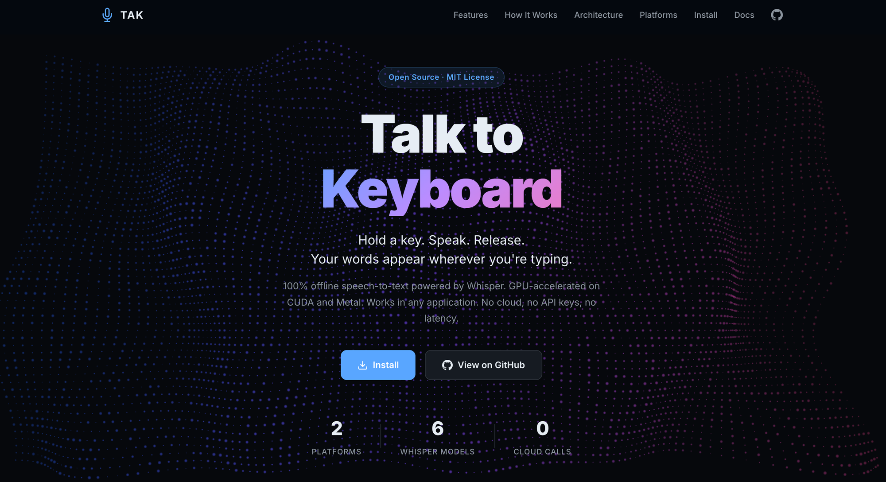
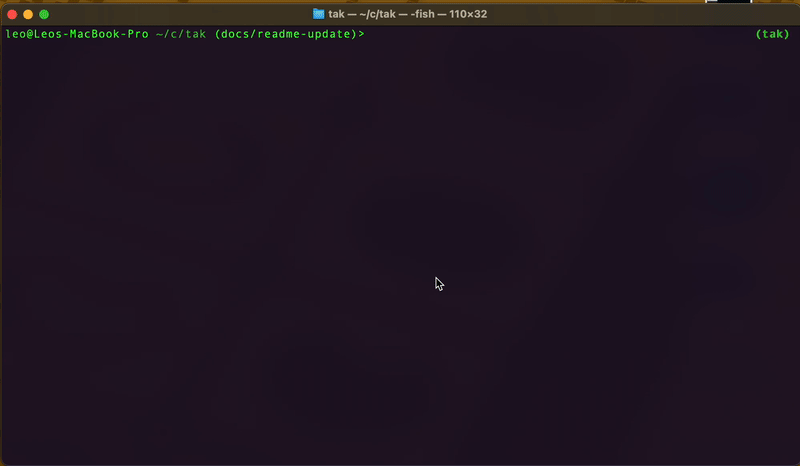
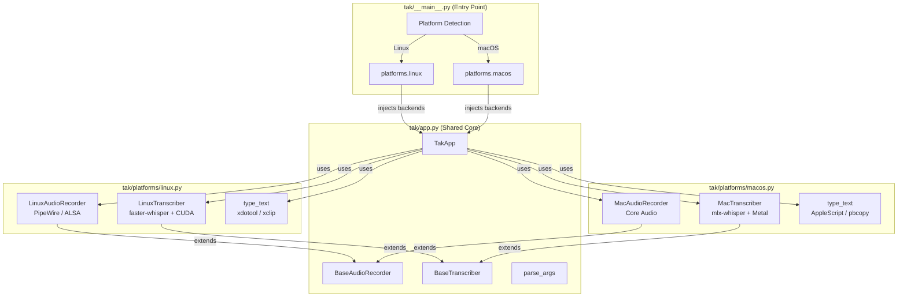

# TAK — Talk to Keyboard


[](https://github.com/sponsors/lchonkan)

**[Website](https://lchonkan.github.io/tak)** | **[Install](#installation)** | **[Sponsor](https://github.com/sponsors/lchonkan)**

<p align="center">
  <a href="https://lchonkan.github.io/tak">
    
  </a>
</p>

Push-to-talk speech-to-text that types anywhere.

Hold a key → speak → release → your words appear wherever you're typing.
Works in any application — terminals, browsers, editors, chat apps, anything with a text cursor.



## Support TAK

TAK is free and open source (MIT). If it makes your workflow faster, consider supporting continued development:

| Method | Details |
|--------|---------|
| **Credit card** | [Sponsor on GitHub](https://github.com/sponsors/lchonkan) — no fees, recurring or one-time |
| **Solana (SOL)** | `GWhM8kiCcAKqsNn1WMfyVv1tgTCdz6mGCGWy3UqqHLQx` |

All crypto goes directly to the maintainer's wallets. Full details: [docs/donations.md](docs/donations.md)

## Features

- **Push-to-talk** — microphone is only open while you hold the key (no always-on listening)
- **System-wide** — types into whatever window/field currently has focus
- **Cross-platform** — Linux (X11) and macOS (Apple Silicon)
- **Bilingual** — auto-detects English and Spanish
- **Local & private** — runs entirely on your machine via [faster-whisper](https://github.com/SYSTRAN/faster-whisper) (Linux) or [mlx-whisper](https://github.com/ml-explore/mlx-examples) (macOS) — no cloud APIs
- **GPU-accelerated** — uses CUDA on NVIDIA GPUs (Linux) or Metal on Apple Silicon (macOS)
- **Auto-normalization** — automatically boosts quiet microphone levels
- **Voice activity detection** — filters out silence and background noise
- **Modular architecture** — platform-agnostic core with pluggable backends
- **Visual overlay** — floating recording indicator on all screens (macOS)
- **Configurable** — choose your trigger key, model size, and input method

## Requirements

### Linux

- Linux with X11 (Wayland support planned)
- NVIDIA GPU with CUDA (or use `--cpu` for CPU-only)
- [Conda](https://docs.anaconda.com/miniconda/) (Miniconda or Anaconda)
- System packages: `xdotool`, `xclip`, `libportaudio2`

### macOS

- macOS 13+ (Ventura or later)
- Apple Silicon (M1/M2/M3/M4) recommended — Metal GPU acceleration via MLX
- Intel Macs work but run CPU-only inference (significantly slower)
- [Homebrew](https://brew.sh/)
- [Conda](https://docs.anaconda.com/miniconda/) (Miniconda or Anaconda)

## Installation

### Quick Install (macOS and Linux)

```bash
git clone https://github.com/lchonkan/tak.git
cd tak
./install.sh
```

The installer automatically detects your platform, installs system dependencies, creates a conda environment, and verifies the setup.

### Manual Install

### Linux

#### 1. Install system dependencies

```bash
sudo apt install xdotool xclip libportaudio2
```

#### 2. Create the Conda environment

```bash
conda create -n tak python=3.11 -y
conda activate tak
```

#### 3. Install Python dependencies

```bash
pip install -r requirements-linux.txt
```

Or install manually:

```bash
pip install faster-whisper pynput sounddevice numpy
```

For GPU acceleration (recommended), also install the CUDA libraries:

```bash
pip install nvidia-cublas-cu12 nvidia-cudnn-cu12
```

#### 4. Input permissions

`pynput` needs access to `/dev/input` to detect key presses. Add your user to the `input` group:

```bash
sudo usermod -aG input $USER
# Log out and back in for the change to take effect
```

### macOS

```bash
# 1. Install system dependencies
brew install portaudio ffmpeg

# 2. Create Conda environment and install Python packages
conda create -n tak python=3.11 -y
conda activate tak
pip install -r requirements-macos.txt

# 3. Grant Accessibility permission (required for key detection)
#    System Settings → Privacy & Security → Accessibility → add your terminal app

# 4. Run
./run.sh
```

TAK checks for Accessibility permission on startup and will show a clear error if it's missing. macOS will also prompt for Microphone access on the first recording — click "Allow".

## Quick Start

### Linux

```bash
./run.sh
```

Hold **Right Ctrl** → speak → release → text appears at cursor. Press `Ctrl+C` to quit.

### macOS

```bash
./run.sh
```

Hold **Right Option** → speak → release → text appears at cursor. Press `Ctrl+C` to quit.

A red **REC** pill appears at the bottom of every screen while recording, turning yellow during transcription.

First run downloads the Whisper model (~1.5 GB). Subsequent runs start much faster.

## Usage

### Options

```
./run.sh --key caps_lock       # Use a different trigger key
./run.sh --model large-v3      # More accurate (uses more VRAM)
./run.sh --model small          # Faster, less accurate
./run.sh --model tiny           # Fastest, least accurate
./run.sh --clipboard            # Use clipboard paste (always on for macOS)
./run.sh --cpu                  # Run on CPU (Linux only, no GPU required)
./run.sh --device 2             # Use a specific audio input device
```

You can also run directly with Python (after activating the conda env):

```bash
conda activate tak
python -m tak --model medium
```

### Platform defaults

|                  | Linux                  | macOS                    |
|------------------|------------------------|--------------------------|
| Trigger key      | `ctrl_r` (Right Ctrl)  | `alt_r` (Right Option)   |
| Whisper model    | `medium`               | `turbo`                  |
| Text injection   | Simulated keystrokes   | Clipboard paste (Cmd+V)  |
| GPU acceleration | CUDA (NVIDIA)          | Metal (Apple Silicon)    |

### Available trigger keys

```
alt_r (macOS default), ctrl_r (Linux default), ctrl_l, alt_l,
shift_r, shift_l, scroll_lock, pause, insert, f1–f12, caps_lock
```

> **Note:** `scroll_lock`, `pause`, and `insert` are only available on Linux.

### Model sizes

| Model      | VRAM/RAM | Speed   | Accuracy | Notes          |
|------------|----------|---------|----------|----------------|
| `tiny`     | ~1 GB   | Fastest | Basic    |                |
| `base`     | ~1 GB   | Fast    | Good     |                |
| `small`    | ~2 GB   | Moderate| Better   |                |
| `medium`   | ~5 GB   | Slower  | Great    | Linux default  |
| `large-v3` | ~6 GB   | Slowest | Best     |                |
| `turbo`    | ~2 GB   | Fast    | Great    | macOS default  |

Models are downloaded on first use and cached in `~/.cache/huggingface/hub/`.

## How It Works

TAK has three main stages that run in a loop:

1. **Key listener** — `pynput` monitors for the trigger key. On press, recording starts; on release, recording stops.
2. **Audio recording** — On Linux, captures audio via PipeWire (`pw-record`) or falls back to ALSA via `sounddevice`. On macOS, captures audio via Core Audio through `sounddevice`. Audio is resampled to 16 kHz mono (Whisper's native format). Quiet audio is auto-normalized so Whisper can hear it.
3. **Transcription & typing** — On Linux, `faster-whisper` transcribes the audio using CUDA on your NVIDIA GPU. On macOS, `mlx-whisper` transcribes using Metal on Apple Silicon. The detected text is injected into the focused window using platform-specific methods (xdotool on Linux, clipboard paste via Cmd+V on macOS).

Transcription runs in a background thread so the key listener stays responsive. If you start a new recording while the previous one is still being transcribed, it waits until the current transcription finishes.

On macOS, a floating pill overlay appears on all connected screens: red while recording, yellow while transcribing. The overlay uses PyObjC (NSPanel) and runs on the main thread via an NSApplication event loop, while pynput runs in a daemon thread.

## Architecture

TAK uses a modular architecture with dependency injection. The core application logic is platform-agnostic, while platform-specific backends (audio recording, transcription, text injection) are plugged in at startup.



For detailed architecture diagrams (class diagrams, sequence diagrams, state machines, threading model, audio pipeline, and more), see **[docs/architecture.md](docs/architecture.md)**.

### Project structure

```
tak/                                # Project root
├── run.sh                          # Cross-platform launcher
├── requirements-linux.txt          # Linux Python dependencies
├── requirements-macos.txt          # macOS Python dependencies
├── README.md                       # This file
├── CONTRIBUTING.md                 # Git Flow and contributor guide
├── CLAUDE.md                       # Instructions for Claude Code
├── LICENSE
├── docs/
│   ├── architecture.md             # Detailed architecture diagrams
│   ├── platform-architecture.md    # Cross-platform stack comparison
│   └── macos-implementation-plan.md # macOS implementation spec (completed)
├── tak/                            # Python package
│   ├── __init__.py                 # Package marker
│   ├── __main__.py                 # Entry point (platform detection, backend wiring)
│   ├── app.py                      # Shared core (TakApp, base classes, CLI, constants)
│   ├── platforms/
│   │   ├── linux.py                # Linux backend (faster-whisper, PipeWire/ALSA, xdotool)
│   │   └── macos.py                # macOS backend (mlx-whisper, Core Audio, AppleScript)
│   └── ui/
│       └── overlay_macos.py        # macOS floating overlay (PyObjC)
└── .gitignore
```

## Troubleshooting

### Linux: Text doesn't appear in some apps

Some applications don't accept simulated keystrokes from `xdotool`. Use clipboard mode instead:

```bash
./run.sh --clipboard
```

### Linux: Permission denied / key not detected

`pynput` needs access to `/dev/input`. Make sure your user is in the `input` group:

```bash
sudo usermod -aG input $USER
# Log out and back in
```

### No audio input

List available audio devices:

```bash
conda activate tak && python -m sounddevice
```

Then specify the device index:

```bash
./run.sh --device <index>
```

### macOS: Accessibility permission not granted

TAK needs Accessibility permission for `pynput` to detect global key events. Go to:

```
System Settings → Privacy & Security → Accessibility
```

Add your terminal app (Terminal.app, iTerm2, etc.) to the list.

### macOS: Microphone permission

macOS will prompt for microphone access on the first recording attempt. Click "Allow" when prompted. If you accidentally denied it, re-enable in:

```
System Settings → Privacy & Security → Microphone
```

### PipeWire not available

If `pw-record` is not installed, TAK automatically falls back to direct ALSA recording via `sounddevice`. This works but may not see PipeWire virtual devices (e.g., Bluetooth headsets routed through PipeWire). To install PipeWire tools:

```bash
sudo apt install pipewire-pulse pipewire-audio-client-libraries
```

### CUDA errors on startup

Make sure you have the NVIDIA CUDA pip packages installed:

```bash
pip install nvidia-cublas-cu12 nvidia-cudnn-cu12
```

Or bypass GPU entirely:

```bash
./run.sh --cpu
```

### Model download is slow

Whisper models are downloaded from Hugging Face on first use. If downloads are slow, you can set a mirror:

```bash
export HF_ENDPOINT=https://hf-mirror.com
./run.sh
```

## TODO

- [ ] Apple Developer ID code signing and notarization for Gatekeeper-ready distribution
- [ ] DMG installer packaging
- [ ] Auto-launch on login (Launch Agent / Login Item)
- [ ] Wayland support (Linux)
- [ ] Windows support
- [ ] In-app model download progress indicator
- [ ] Multiple language selection in preferences
- [ ] Test model switching behavior (what happens when user changes model in Settings)
- [ ] Evaluate which Whisper models to expose to end users
- [ ] Fix Spanish accent characters pasting incorrectly (keyboard input encoding)

## Contributing

Contributions are welcome! See [CONTRIBUTING.md](CONTRIBUTING.md) for the branching model, commit conventions, and PR guidelines.

## License

MIT
