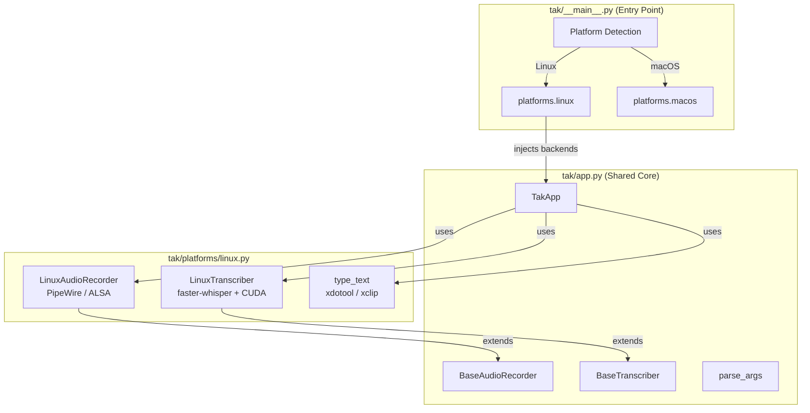

# TAK — Talk to Keyboard


Push-to-talk speech-to-text that types anywhere.

Hold a key → speak → release → your words appear wherever you're typing.
Works in any application — terminals, browsers, editors, chat apps, anything with a text cursor.

## Features

- **Push-to-talk** — microphone is only open while you hold the key (no always-on listening)
- **System-wide** — types into whatever window/field currently has focus
- **Cross-platform** — Linux (X11) and macOS (Apple Silicon)
- **Bilingual** — auto-detects English and Spanish
- **Local & private** — runs entirely on your machine via [faster-whisper](https://github.com/SYSTRAN/faster-whisper) (Linux) or [mlx-whisper](https://github.com/ml-explore/mlx-examples) (macOS) — no cloud APIs
- **GPU-accelerated** — uses CUDA on NVIDIA GPUs (Linux) or Metal on Apple Silicon (macOS)
- **Auto-normalization** — automatically boosts quiet microphone levels
- **Voice activity detection** — filters out silence and background noise
- **Modular architecture** — platform-agnostic core with pluggable backends
- **Configurable** — choose your trigger key, model size, and input method

## Requirements

### Linux

- Linux with X11 (Wayland support planned)
- NVIDIA GPU with CUDA (or use `--cpu` for CPU-only)
- [Conda](https://docs.anaconda.com/miniconda/) (Miniconda or Anaconda)
- System packages: `xdotool`, `xclip`, `libportaudio2`

### macOS

- macOS 13+ (Ventura or later)
- Apple Silicon (M1/M2/M3/M4) recommended — Metal GPU acceleration via MLX
- Intel Macs work but run CPU-only inference (significantly slower)
- [Homebrew](https://brew.sh/)
- [Conda](https://docs.anaconda.com/miniconda/) (Miniconda or Anaconda)

## Installation

### Linux

#### 1. Install system dependencies

```bash
sudo apt install xdotool xclip libportaudio2
```

#### 2. Create the Conda environment

```bash
conda create -n tak python=3.11 -y
conda activate tak
```

#### 3. Install Python dependencies

```bash
pip install -r requirements-linux.txt
```

Or install manually:

```bash
pip install faster-whisper pynput sounddevice numpy
```

For GPU acceleration (recommended), also install the CUDA libraries:

```bash
pip install nvidia-cublas-cu12 nvidia-cudnn-cu12
```

#### 4. Input permissions

`pynput` needs access to `/dev/input` to detect key presses. Add your user to the `input` group:

```bash
sudo usermod -aG input $USER
# Log out and back in for the change to take effect
```

### macOS

#### 1. Install system dependencies

```bash
brew install portaudio
```

#### 2. Create the Conda environment

```bash
conda create -n tak python=3.11 -y
conda activate tak
```

#### 3. Install Python dependencies

```bash
pip install -r requirements-macos.txt
```

Or install manually:

```bash
pip install mlx-whisper pynput sounddevice numpy
```

#### 4. Accessibility permission

`pynput` needs Accessibility permission to detect global key events:

```
System Settings → Privacy & Security → Accessibility → add your terminal app
```

TAK checks for this on startup and will show a clear error if it's missing.

> **Tip:** MacBook keyboards don't have Right Ctrl. Use `--key caps_lock` instead.

## Quick Start

```bash
./run.sh
```

First run downloads the Whisper model (~1.5 GB for the default `medium` model). Subsequent runs start much faster.

```
Hold Right-Ctrl → Speak → Release → Text appears at cursor
Press Ctrl+C in terminal to quit
```

## Usage

### Options

```
./run.sh --key scroll_lock     # Use a different trigger key
./run.sh --model large-v3      # More accurate (uses more VRAM)
./run.sh --model small          # Faster, less accurate
./run.sh --model tiny           # Fastest, least accurate
./run.sh --clipboard            # Use Ctrl+V paste instead of simulated typing
./run.sh --cpu                  # Run on CPU (no GPU required)
./run.sh --device 2             # Use a specific audio input device
```

You can also run directly with Python (after activating the conda env):

```bash
conda activate tak
python -m tak --key ctrl_r --model medium
```

### Available trigger keys

```
ctrl_r (default), ctrl_l, alt_r, alt_l, shift_r, shift_l,
scroll_lock, pause, insert, f1–f12, caps_lock
```

### Model sizes

| Model      | VRAM/RAM | Speed   | Accuracy | Notes          |
|------------|----------|---------|----------|----------------|
| `tiny`     | ~1 GB   | Fastest | Basic    |                |
| `base`     | ~1 GB   | Fast    | Good     |                |
| `small`    | ~2 GB   | Moderate| Better   |                |
| `medium`   | ~5 GB   | Slower  | Great    | Linux default  |
| `large-v3` | ~6 GB   | Slowest | Best     |                |
| `turbo`    | ~2 GB   | Fast    | Great    | macOS default  |

Models are downloaded on first use and cached in `~/.cache/huggingface/hub/`.

## How It Works

TAK has three main stages that run in a loop:

1. **Key listener** — `pynput` monitors for the trigger key. On press, recording starts; on release, recording stops.
2. **Audio recording** — On Linux, captures audio via PipeWire (`pw-record`) or falls back to ALSA via `sounddevice`. On macOS, captures audio via Core Audio through `sounddevice`. Audio is resampled to 16 kHz mono (Whisper's native format). Quiet audio is auto-normalized so Whisper can hear it.
3. **Transcription & typing** — On Linux, `faster-whisper` transcribes the audio using CUDA on your NVIDIA GPU. On macOS, `mlx-whisper` transcribes using Metal on Apple Silicon. The detected text is typed into the focused window using platform-specific text injection (xdotool on Linux, AppleScript on macOS).

Transcription runs in a background thread so the key listener stays responsive. If you start a new recording while the previous one is still being transcribed, it waits until the current transcription finishes.

## Architecture

TAK uses a modular architecture with dependency injection. The core application logic is platform-agnostic, while platform-specific backends (audio recording, transcription, text injection) are plugged in at startup.



For detailed architecture diagrams (class diagrams, sequence diagrams, state machines, threading model, audio pipeline, and more), see **[docs/architecture.md](docs/architecture.md)**.

### Project structure

```
tak/                                # Project root
├── run.sh                          # Cross-platform launcher
├── requirements-linux.txt          # Linux Python dependencies
├── requirements-macos.txt          # macOS Python dependencies
├── README.md                       # This file
├── CONTRIBUTING.md                 # Git Flow and contributor guide
├── CLAUDE.md                       # Instructions for Claude Code
├── LICENSE
├── docs/
│   ├── architecture.md             # Detailed architecture diagrams
│   └── macos-implementation-plan.md
├── tak/                            # Python package
│   ├── __init__.py                 # Package marker
│   ├── __main__.py                 # Entry point (platform detection, backend wiring)
│   ├── app.py                      # Shared core (TakApp, base classes, CLI, constants)
│   ├── platforms/
│   │   ├── linux.py                # Linux backend (faster-whisper, PipeWire/ALSA, xdotool)
│   │   └── macos.py                # macOS backend (mlx-whisper, Core Audio, AppleScript)
│   └── ui/                         # UI layer (planned)
└── .gitignore
```

## Troubleshooting

### Text doesn't appear in some apps

Some applications don't accept simulated keystrokes from `xdotool`. Use clipboard mode instead:

```bash
./run.sh --clipboard
```

### Permission denied / key not detected

`pynput` needs access to `/dev/input`. Make sure your user is in the `input` group:

```bash
sudo usermod -aG input $USER
# Log out and back in
```

### No audio input

List available audio devices:

```bash
conda activate tak && python -m sounddevice
```

Then specify the device index:

```bash
./run.sh --device <index>
```

### macOS: Accessibility permission not granted

TAK needs Accessibility permission for `pynput` to detect global key events. Go to:

```
System Settings → Privacy & Security → Accessibility
```

Add your terminal app (Terminal.app, iTerm2, etc.) to the list.

### macOS: Microphone permission

macOS will prompt for microphone access on the first recording attempt. Click "Allow" when prompted. If you accidentally denied it, re-enable in:

```
System Settings → Privacy & Security → Microphone
```

### macOS: No Right Ctrl on MacBook keyboards

MacBook keyboards don't have a Right Ctrl key. Use Caps Lock instead:

```bash
./run.sh --key caps_lock
```

### PipeWire not available

If `pw-record` is not installed, TAK automatically falls back to direct ALSA recording via `sounddevice`. This works but may not see PipeWire virtual devices (e.g., Bluetooth headsets routed through PipeWire). To install PipeWire tools:

```bash
sudo apt install pipewire-pulse pipewire-audio-client-libraries
```

### CUDA errors on startup

Make sure you have the NVIDIA CUDA pip packages installed:

```bash
pip install nvidia-cublas-cu12 nvidia-cudnn-cu12
```

Or bypass GPU entirely:

```bash
./run.sh --cpu
```

### Model download is slow

Whisper models are downloaded from Hugging Face on first use. If downloads are slow, you can set a mirror:

```bash
export HF_ENDPOINT=https://hf-mirror.com
./run.sh
```

## Contributing

Contributions are welcome! See [CONTRIBUTING.md](CONTRIBUTING.md) for the branching model, commit conventions, and PR guidelines.

## License

MIT
