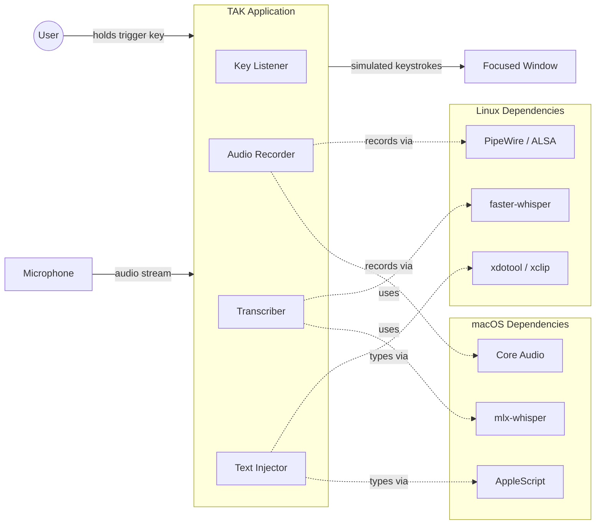
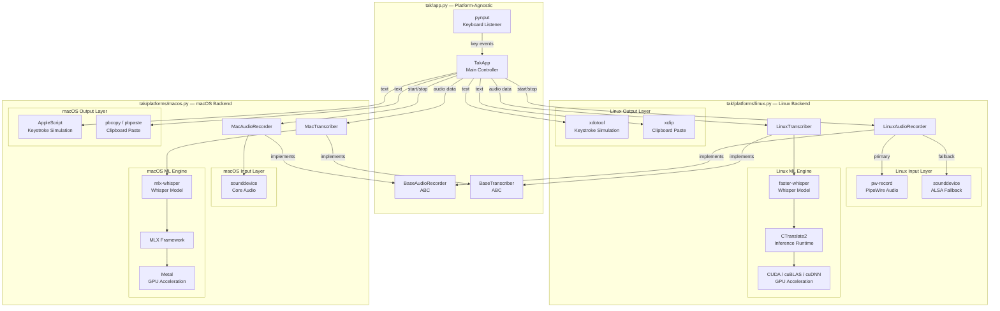
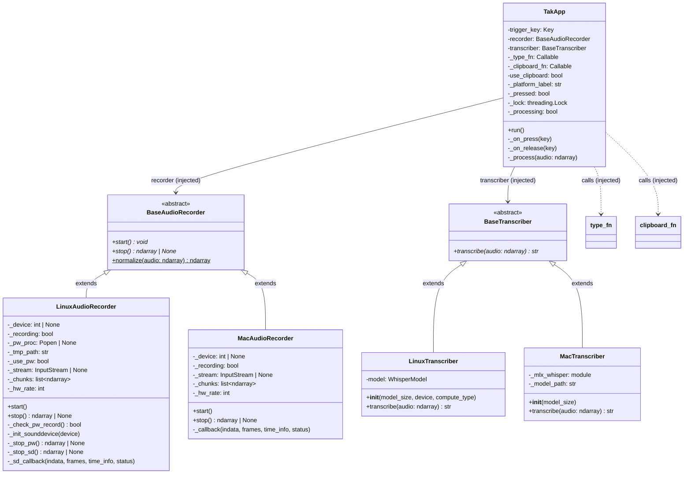
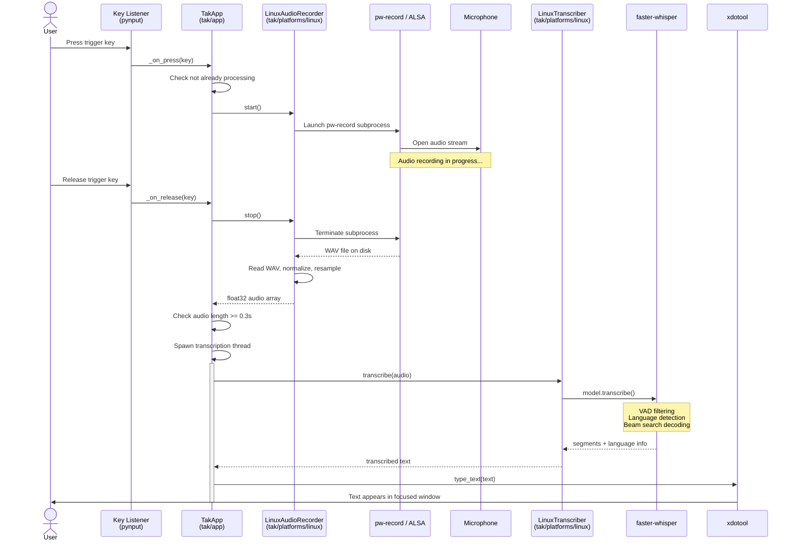
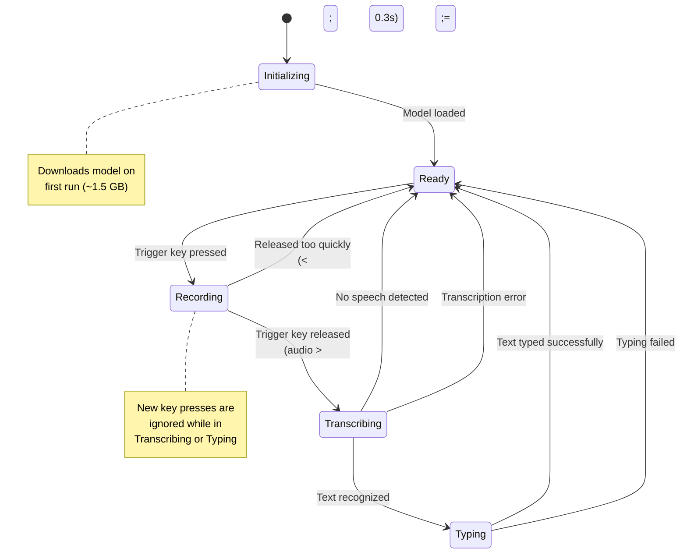
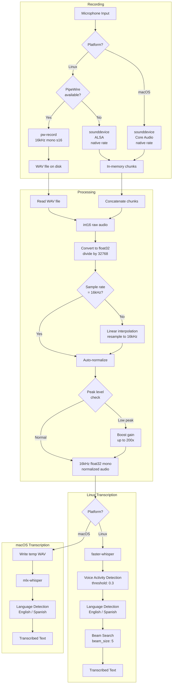
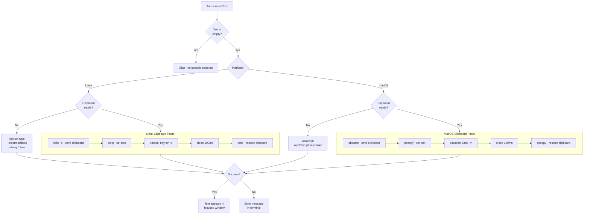
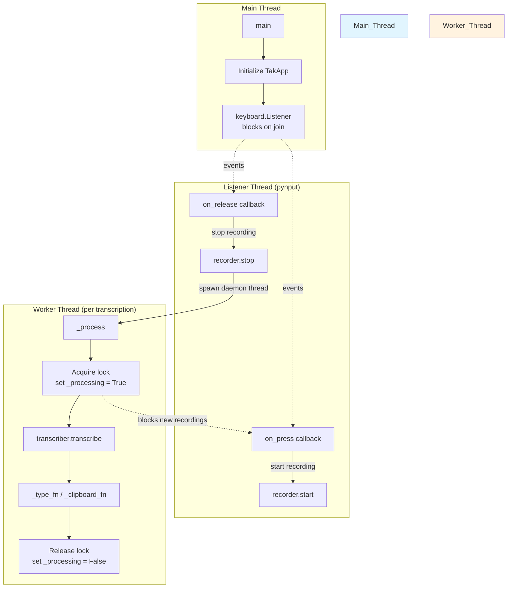
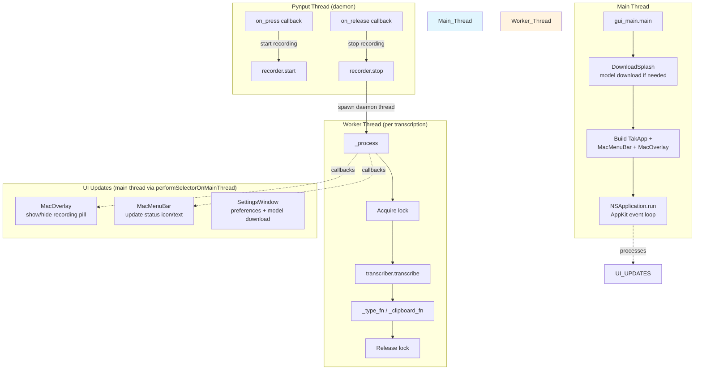

# TAK Architecture


Detailed software architecture documentation for TAK (Talk to Keyboard).

## Table of Contents

- [System Overview](#system-overview)
- [Module Structure](#module-structure)
- [Component Diagram](#component-diagram)
- [Class Diagram](#class-diagram)
- [Push-to-Talk Sequence](#push-to-talk-sequence)
- [Application State Machine](#application-state-machine)
- [Audio Pipeline](#audio-pipeline)
- [Text Injection Flow](#text-injection-flow)
- [Threading Model](#threading-model)
- [CUDA Initialization](#cuda-initialization)

---

## System Overview

TAK is a single-process, multi-threaded application that captures speech via push-to-talk and types the transcribed text into any focused window. It uses a modular architecture with platform-agnostic core logic and pluggable platform backends. All processing happens locally — no network calls are made after the initial model download.



---

## Module Structure

TAK has two entry points (CLI and GUI), a platform-agnostic core, pluggable platform backends, and a macOS-native UI layer. Platform branching happens only in the entry points — the core module has no platform-specific imports.

```mermaid
graph TD
    subgraph "Entry Points"
        EP_CLI["tak/__main__.py — CLI<br/>Platform detection · CLI args<br/>Backend wiring"]
        EP_GUI["tak/gui_main.py — GUI<br/>macOS .app bundle<br/>NSUserDefaults config"]
    end

    subgraph "tak/app.py — Shared Core"
        TAKAPP[TakApp]
        BASE[BaseAudioRecorder<br/>BaseTranscriber]
        UTIL[parse_args · colors · constants<br/>KEY_MAP · _resample · normalize]
    end

    subgraph "tak/config.py"
        CONFIG[TakConfig dataclass]
    end

    subgraph "tak/platforms/linux.py — Linux Backend"
        CUDA_INIT[ensure_cuda_libs]
        LINUX_TR[LinuxTranscriber]
        LINUX_REC[LinuxAudioRecorder]
        LINUX_TI[type_text · type_text_clipboard]
        LINUX_IF[platform_setup · get_default_model<br/>get_platform_label]
    end

    subgraph "tak/platforms/macos.py — macOS Backend"
        ACC_CHK[check_accessibility_permission]
        MAC_TR[MacTranscriber]
        MAC_REC[MacAudioRecorder]
        MAC_TI[type_text · type_text_clipboard]
        MAC_IF[platform_setup · get_default_model<br/>get_platform_label]
    end

    subgraph "tak/ui/ — macOS UI Layer"
        DESIGN[design.py<br/>Colors · Fonts · CardView]
        OVERLAY[overlay_macos.py<br/>Recording pill overlay]
        MENUBAR[menubar_macos.py<br/>NSStatusItem · dropdown menu]
        SETTINGS[settings_macos.py<br/>Preferences window<br/>NSUserDefaults persistence]
        SPLASH[splash_macos.py<br/>Model download splash]
    end

    EP_CLI -->|imports| TAKAPP
    EP_CLI -->|imports on Linux| LINUX_IF
    EP_CLI -->|imports on macOS| MAC_IF
    EP_GUI -->|imports| TAKAPP
    EP_GUI -->|imports| MAC_IF
    EP_GUI -->|loads config| CONFIG
    EP_GUI -->|builds UI| MENUBAR
    EP_GUI -->|builds UI| OVERLAY
    EP_GUI -->|shows on first run| SPLASH
    SETTINGS -->|reads/writes| CONFIG
    SETTINGS -->|uses| DESIGN
    SPLASH -->|uses| DESIGN
    MENUBAR -->|opens| SETTINGS
    LINUX_TR -->|extends| BASE
    LINUX_REC -->|extends| BASE
    MAC_TR -->|extends| BASE
    MAC_REC -->|extends| BASE
    TAKAPP -->|uses injected| LINUX_TR
    TAKAPP -->|uses injected| LINUX_REC
    TAKAPP -->|uses injected| LINUX_TI
    TAKAPP -->|uses injected| MAC_TR
    TAKAPP -->|uses injected| MAC_REC
    TAKAPP -->|uses injected| MAC_TI
```



### Design Principles

- **No `if IS_MACOS` inside core.** Platform branching happens only in entry points (`tak/__main__.py`, `tak/gui_main.py`).
- **Two entry points.** `__main__.py` for CLI usage, `gui_main.py` for the macOS `.app` bundle (uses NSUserDefaults instead of CLI args).
- **Constructor injection.** `TakApp` receives backends as arguments — it never imports a platform module.
- **Each platform file is self-contained.** Deleting `tak/platforms/linux.py` on a Mac causes no errors.
- **Shared utilities in core.** Resampling, normalization, colors, constants, CLI parsing — all platform-agnostic.
- **Shared design system.** `tak/ui/design.py` provides color tokens, fonts, and reusable views for all macOS UI components.

---

## Component Diagram

A detailed view of all components, their responsibilities, and how they interconnect. Components are organized by module.



---

## Class Diagram

The class hierarchy uses abstract base classes in `tak/app.py` with concrete implementations in platform modules. `TakApp` receives its dependencies via constructor injection.



### Module ownership

| Class / Function | Module |
|---|---|
| `TakApp`, `BaseAudioRecorder`, `BaseTranscriber`, `parse_args()` | `tak/app.py` |
| `TakConfig` | `tak/config.py` |
| `LinuxAudioRecorder`, `LinuxTranscriber`, `type_text()`, `type_text_clipboard()` | `tak/platforms/linux.py` |
| `MacAudioRecorder`, `MacTranscriber`, `type_text()`, `type_text_clipboard()` | `tak/platforms/macos.py` |
| CLI platform detection, backend wiring | `tak/__main__.py` |
| GUI entry point, NSUserDefaults config, download splash | `tak/gui_main.py` |
| `MacMenuBar` (NSStatusItem, dropdown menu) | `tak/ui/menubar_macos.py` |
| `SettingsWindow` (preferences panel, NSUserDefaults persistence) | `tak/ui/settings_macos.py` |
| `MacOverlay` (floating recording pill) | `tak/ui/overlay_macos.py` |
| `DownloadSplash` (model download progress) | `tak/ui/splash_macos.py` |
| Design tokens, `CardView`, `BarView`, font helpers | `tak/ui/design.py` |

---

## Push-to-Talk Sequence

The complete lifecycle of a single push-to-talk interaction. The Linux backend is shown below; macOS follows the same pattern with `MacAudioRecorder` → Core Audio and `MacTranscriber` → mlx-whisper → AppleScript.



---

## Application State Machine

The states TAK transitions through during operation.



---

## Audio Pipeline

How audio flows from microphone to Whisper-ready format.



---

## Text Injection Flow

How transcribed text gets typed into the target application. Each platform uses its own tools for keystroke simulation and clipboard paste.



---

## Threading Model

How TAK manages concurrency to keep the UI responsive.

### CLI mode (Linux and macOS via `python -m tak`)



### GUI mode (macOS `.app` bundle via `gui_main.py`)

In the `.app` bundle, the main thread runs the NSApplication event loop (required for AppKit UI). The pynput key listener runs in a daemon thread instead.



The threading lock (`_lock`) ensures that:
- Only one transcription runs at a time
- New key presses are ignored while a transcription is in progress
- State transitions are atomic

In GUI mode, all AppKit UI updates (overlay, menu bar, settings window) must happen on the main thread. Background threads use `performSelectorOnMainThread:` to dispatch UI work safely.

---

## CUDA Initialization (Linux Only)

How TAK pre-loads NVIDIA libraries before the Whisper model is initialized. This runs on Linux only, triggered by `tak.platforms.linux.platform_setup()` during startup. For macOS, MLX handles GPU initialization automatically — see [platform-architecture.md](platform-architecture.md) for the full cross-platform comparison.

```mermaid
sequenceDiagram
    participant EP as tak/__main__.py
    participant LINUX as platforms/linux.py
    participant CTYPES as ctypes
    participant FS as Filesystem
    participant CUDA as CUDA Libraries
    participant CT2 as CTranslate2
    participant WHISPER as faster-whisper

    EP->>LINUX: platform_setup()
    LINUX->>LINUX: ensure_cuda_libs()
    LINUX->>FS: Find site-packages path

    LINUX->>FS: Check libcublasLt.so.12
    FS-->>LINUX: exists
    LINUX->>CTYPES: CDLL(libcublasLt.so.12, RTLD_GLOBAL)
    CTYPES->>CUDA: Load into process address space

    LINUX->>FS: Check libcublas.so.12
    FS-->>LINUX: exists
    LINUX->>CTYPES: CDLL(libcublas.so.12, RTLD_GLOBAL)
    CTYPES->>CUDA: Load into process address space

    LINUX->>FS: Check libcudnn.so.9
    FS-->>LINUX: exists
    LINUX->>CTYPES: CDLL(libcudnn.so.9, RTLD_GLOBAL)
    CTYPES->>CUDA: Load into process address space

    Note over LINUX,CUDA: Libraries now in process memory<br/>LD_LIBRARY_PATH is too late at this point

    EP->>LINUX: LinuxTranscriber(model_size, device, compute_type)
    LINUX->>WHISPER: WhisperModel(device="cuda")
    WHISPER->>CT2: Initialize engine
    CT2->>CUDA: Find cublas/cudnn (already loaded)
    CT2-->>WHISPER: Model ready
