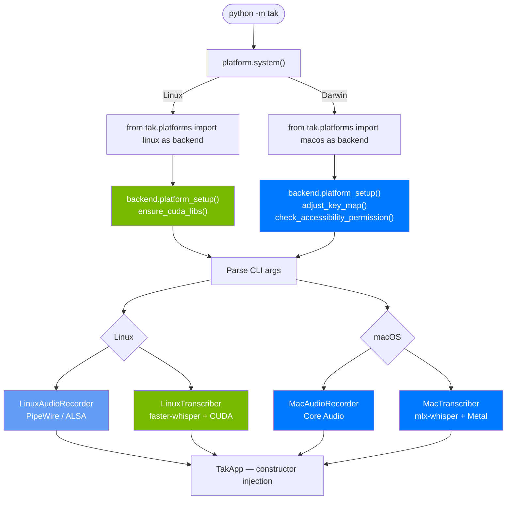
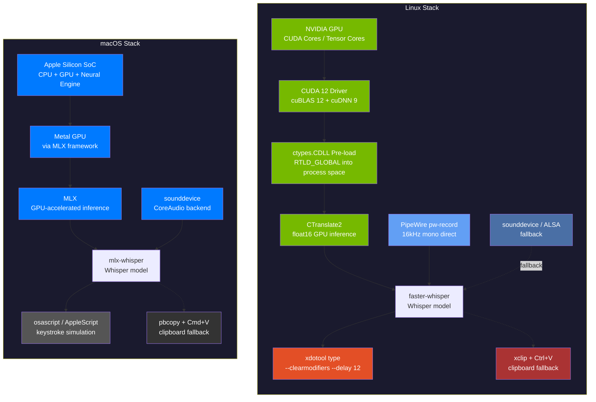
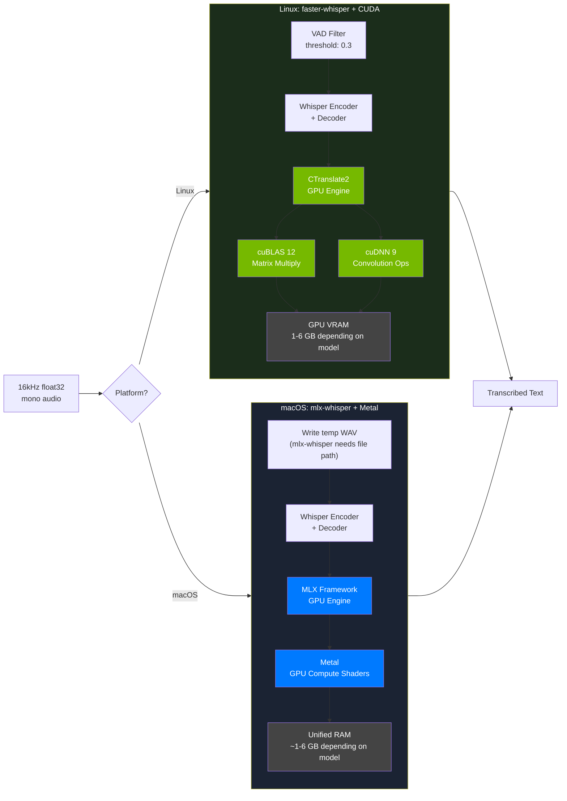
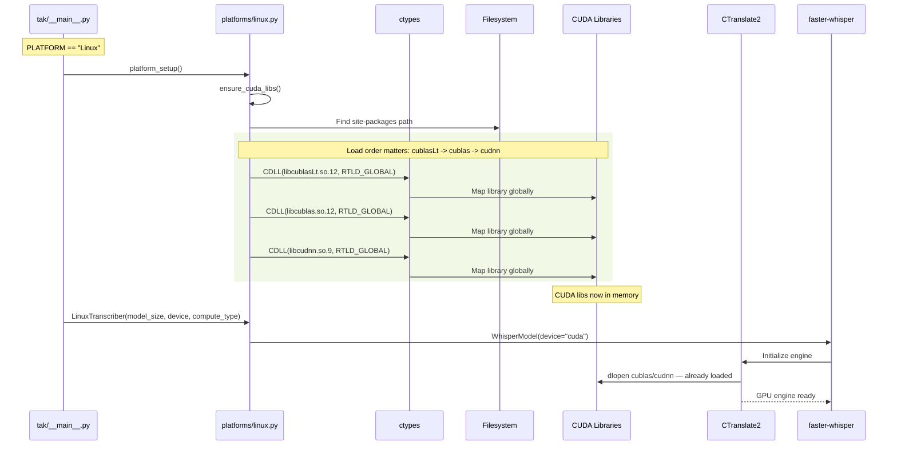
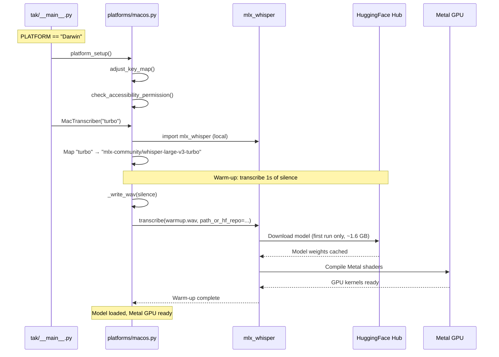
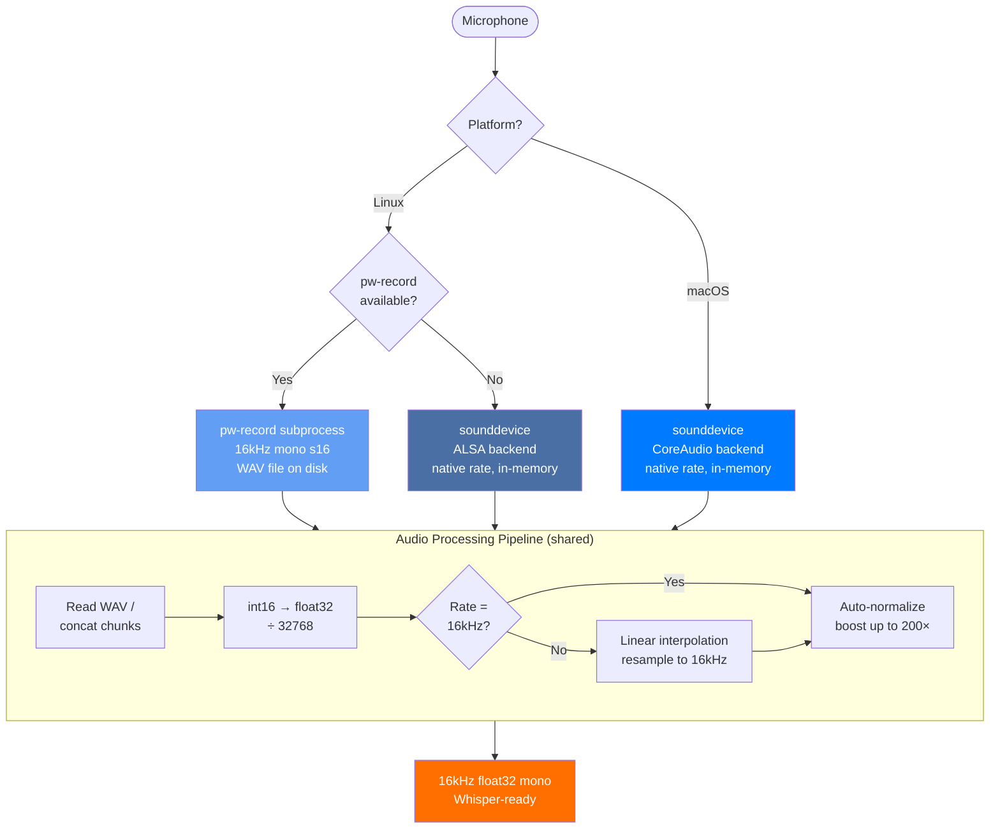
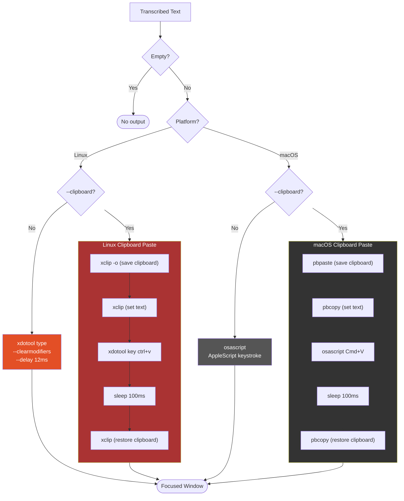

# TAK Platform Architecture

Cross-platform architecture comparison for TAK, covering the full stack from hardware to application layer.

---

## Platform Detection & Dispatch

The entire application branches at a single detection point in `tak/__main__.py`. All platform-specific behavior is isolated in backend modules — the core (`tak/app.py`) has zero platform imports.

---

## Full Stack Comparison

Side-by-side view of every layer, from hardware through application output.

---

## ML Inference Layer Detail

How the ML inference path differs between platforms.

### Key Differences

| Aspect | Linux (faster-whisper) | macOS (mlx-whisper) |
|--------|----------------------|---------------------|
| **Inference engine** | CTranslate2 | MLX |
| **GPU API** | CUDA | Metal |
| **Compute precision** | float16 (GPU) / int8 (CPU) | MLX default (model-dependent) |
| **Input format** | numpy array (in-memory) | File path (temp WAV on disk) |
| **Built-in VAD** | Yes (Silero VAD, configurable) | No (push-to-talk boundaries suffice) |
| **Model format** | CTranslate2 converted | MLX converted (from HuggingFace) |
| **Default model** | `medium` | `turbo` (whisper-large-v3-turbo) |

---

## CUDA Library Pre-load Sequence (Linux Only)

On Linux, CUDA libraries must be loaded into the process address space *before* CTranslate2 initializes. Setting `LD_LIBRARY_PATH` from Python is too late because the dynamic linker has already cached its search paths.

---

## MLX Model Loading Sequence (macOS Only)

On macOS, mlx-whisper loads MLX-optimized Whisper models from HuggingFace Hub. A warm-up transcription runs at startup to trigger the model download and MLX compilation.

---

## Audio Recording Layer

---

## Text Injection Layer

---

## Platform Comparison Matrix

| Layer | Linux | macOS |
|-------|-------|-------|
|  **Accelerator** | NVIDIA CUDA (float16) | Apple Metal via MLX |
|  **Engine** | CTranslate2 + cuBLAS/cuDNN | MLX + Metal GPU |
|  **Whisper Library** | faster-whisper | mlx-whisper |
|  **Default Model** | `medium` | `turbo` (whisper-large-v3-turbo) |
|  **Recording** | PipeWire `pw-record` / ALSA fallback | Core Audio via `sounddevice` |
|  **Text Injection** | `xdotool` / `xclip` | AppleScript / `pbcopy` |
|  **Default Key** | Right Ctrl (`ctrl_r`) | Right Ctrl (`ctrl_r`) |
|  **Access** | `input` group for `/dev/input` | Accessibility + Microphone in System Settings |
|  **Inference Speed** | Fast (CUDA GPU) | Fast (Metal GPU on Apple Silicon) |

---

## Optional Future Enhancements

These are not currently implemented but could improve performance further:

1. **`lightning-whisper-mlx`** — Claims 4× faster than standard mlx-whisper. Could be offered as `--backend lightning`.
2. **Silero VAD preprocessing** — mlx-whisper has no built-in VAD. Could add as optional preprocessing for noisy environments.
3. **Intel Mac detection** — Detect `platform.machine() != "arm64"` and warn about slower CPU-only performance.
4. **CGEventPost text injection** — Better Unicode support than AppleScript. Requires `pyobjc-framework-Quartz`.
